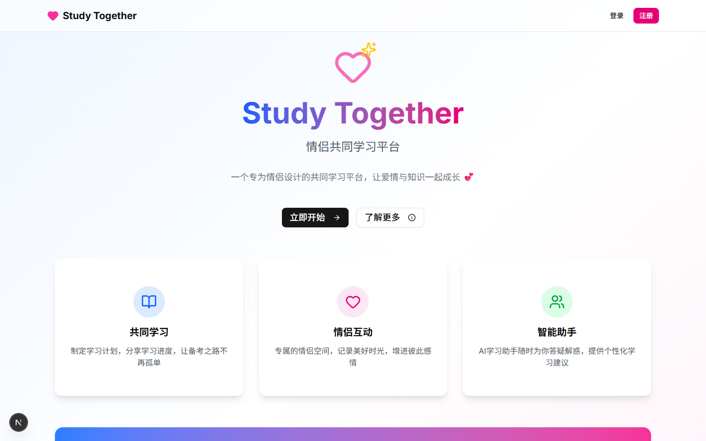

# Study-Together

面向两人共同备考的 Web 应用：把账号配对、学习任务、课程表、资料和留言放在同一处，减少在多个工具之间切换。仓库提供可本地运行的原型，暂无经核实的公开演示地址。



> 截图于 2026-09-24 使用临时空数据库和未配置第三方密钥的本地实例生成，不含真实账号或私人数据。

**当前状态**：主要页面和对应 API 已实现；学习打卡中的学习时长、完成任务数仍为固定演示值，天气在未配置密钥时使用演示数据，系统状态中的 CPU 指标也是模拟值。不能据此宣称这些统计已真实采集。

## 已实现的核心流程

- **账号与配对**：注册、登录、JWT Cookie 会话、邀请码生成与加入、解除配对；服务端通过 Prisma 保存用户和配对关系。
- **学习协作**：学习目标、计划、任务的页面与 API；课程增删、导入、空闲时间查询；文件夹、分类、上传与预览。
- **互动与扩展**：留言及表情反应、聊天记录、管理员用户与站点设置；AI 页面通过服务端调用 DeepSeek，需自行配置密钥。

**个人贡献**：本项目由我独立完成。我实现了页面与 API、Prisma 数据模型，以及账号配对、任务、课程表和资料管理等主要流程。页面和接口见 [`src/app`](src/app)，数据模型见 [`prisma/schema.prisma`](prisma/schema.prisma)；演示数据与待验证功能仍按下文标注。

## 面试可讲的技术点

1. **配对和权限边界**：邀请码与用户、伴侣关系如何落库；在 API 中验证 Cookie、用户身份和数据归属，避免只靠前端路由守卫。
2. **功能状态与真实数据**：任务、课程和文件已有持久化模型；打卡和部分监控值仍为演示数据。可以解释从界面原型到可信统计还需要哪些事件记录和校验。

## 本地运行

需要 Node.js 20+、npm，开发环境使用 SQLite（`prisma/schema.prisma` 中的实际 provider）。

```bash
npm ci
```

将 [`.env.example`](.env.example) 复制为本地 `.env`，为 `JWT_SECRET` 设置随机值。`DEEPSEEK_API_KEY` 与 `NEXT_PUBLIC_AMAP_API_KEY` 只在使用相应外部服务时配置；不要提交真实密钥。高德前端密钥带 `NEXT_PUBLIC_` 前缀，会出现在浏览器代码中，应按高德平台要求限制可用域名与额度。

```bash
npx prisma generate
node -e "const fs=require('node:fs'); fs.closeSync(fs.openSync('prisma/dev.db','a'))"
npx prisma db push
npm run dev
```

中间的 Node 命令只在数据库文件不存在时创建空文件，避免 Windows 上 Prisma 首次创建 SQLite 文件时报 `Schema engine error`；已有文件不会被清空。打开 `http://localhost:3000/landing`，注册账号后体验主流程。配对功能需两个账号。本地数据库文件已被 `.gitignore` 排除。生产环境部署、第三方 API 可用性和多人同时使用尚未在此仓库中验证。

## 仍待完成或验证

- 将打卡时长、完成任务数、系统指标替换为真实采集和统计，并补充回归测试。
- 验证移动端体验、外部 AI 与天气接口在正式部署环境中的稳定性。
- 整理可公开的演示截图；当前仓库未提供经确认可公开的截图。

## 安全说明

早期提交误包含运行配置、Cookie、开发数据库、接口响应和上传文件。当前代码已移除这些文件、加入忽略规则，并重写可更新的 Git 分支历史。2026-09-24 已在当前 DeepSeek 账号的完整密钥列表中核对，仓库曾暴露的旧 DeepSeek 密钥已不在列表中；旧高德密钥和 JWT 密钥仍应视为已泄露，需在各自实际使用的平台核对并轮换。GitHub 的旧 PR 引用、缓存或外部克隆仍可能保留副本，不能仅凭仓库当前文件判断它们已彻底消失。

如果旧 `JWT_SECRET` 曾用于部署，应在实际托管平台的环境变量中生成并替换为新的随机值，然后重启所有应用实例。现有 JWT Cookie 会因签名密钥变化而失效，用户需要重新登录；新密钥不得写入 Git。
